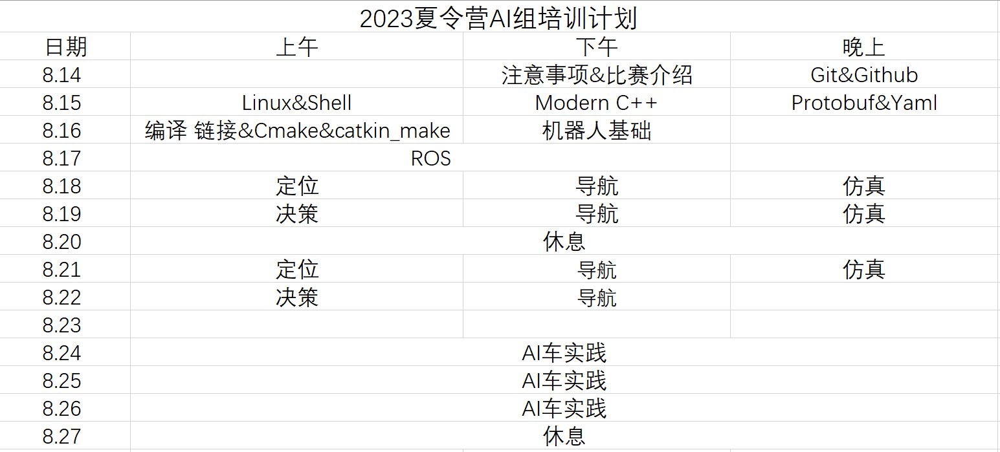

## 吉甲大师2023夏令营AI组培训

AI组知识库：[JLU-AI-Lab](https://tars-cat.github.io/)

### 培训安排

### 培训目标

此次培训希望各成员能够了解机器人自主移动的原理，并且能够在[官方SDK](https://github.com/RoboMaster/RoboRTS)的基础上，由定位、导航、决策三个组别合作实现AI车的自主移动。

### 考核标准

- **ROS考核** : 实现3种通信方式。占比20%。
- **定位/导航/决策考核** : 占比20%。
- **AI车实践考核** : 实现简单的跑点巡逻即可，实现更复杂功能加分。占比40%。
- **平时作业&进度汇报** : 占比20%。